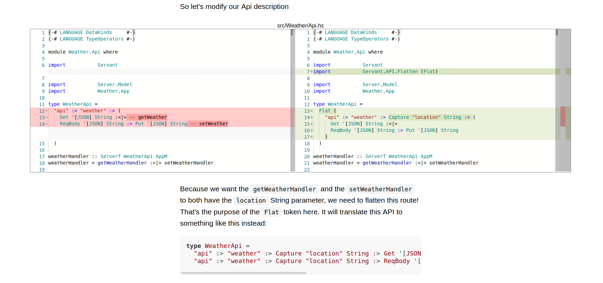

## Kamo

Kamo is a simple blog platform which makes use of the [monaco-editor](github.com/microsoft/monaco-editor/).
It allows you to create article with an embedded diff viewer.

## Build

You'll need [nix](https://nixos.org/download.html) if you want reproducible build. Then just `make install`

If you'd rather work with common nodejs tools, just `npm install`. Then You'll need to run `npm run build`.

## Release

run: `nix-prefetch-url --unpack https://github.com/matsumonkie/kamo/archive/${replace_with_latest_commit}.tar.gz`
This will return the sha256 for the given commit.
Put the commit and the sha256 in `release.json`

## To run

once built, in a nix-shell, run: `node /nix/store/${resultOfTheBuild}-kamo/bin/server.bundle.js`
